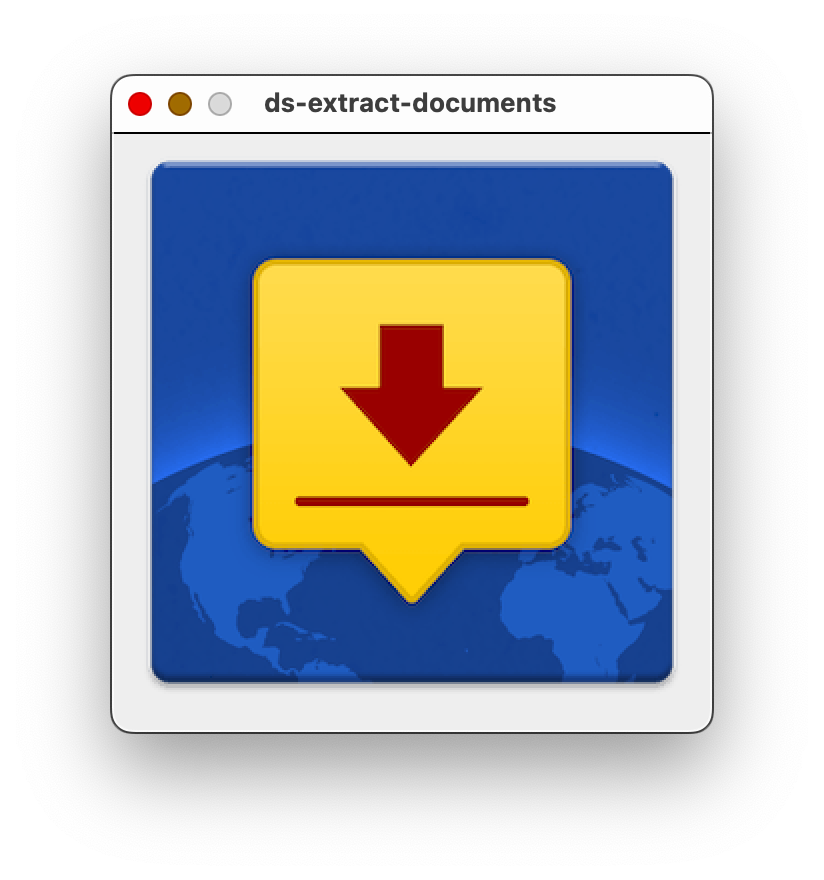

# ds-extract-documents
A simple Java application that:

1. Opens an "always-on-top" window in the top right corner of the desktop
2. Responds to a DocuSign template JSON file being "dropped" (as in drag-and-drop) into the window pane by extracting the embedded documents to the current directory
3. The files are created using the name assigned to them by the DocuSign template

This can be useful when migrating DocuSign templates to Acrobat Sign, as it provides a quick way of reviewing documents to see if the contents are suitable for the Acrobat Sign platform.

The Acrobat Sign platform will reject files if, for example, they contain an invalid digital signature - see [https://helpx.adobe.com/sign/kb/adobesign-doc-upload-error.html](https://helpx.adobe.com/sign/kb/adobesign-doc-upload-error.html) for more details.

